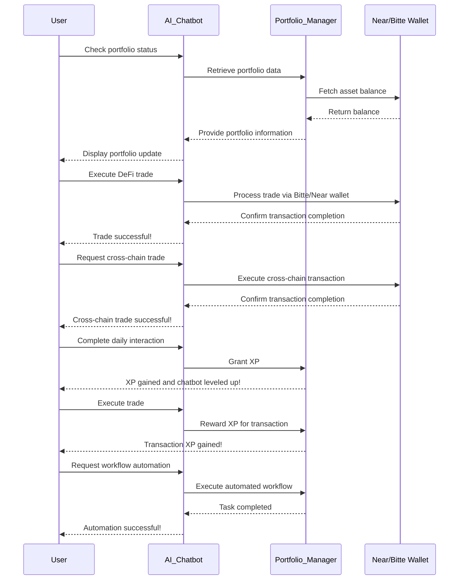

# One-Trillion-Agents-Hackathon

## Overview  
Our project is an AI chatbot-based portfolio management and DeFi automation platform. By incorporating gamification, users can track their assets, execute trades, and grow their AI agents, making portfolio management a fun and educational experience.  

## Problem  
1. **Complex DeFi Management** – Managing multiple wallets and DeFi transactions is challenging.  
2. **Lack of Engagement** – Traditional portfolio trackers only provide data without user interaction.  
3. **User Retention Issues** – Existing financial tools struggle to keep users engaged over time.  
4. **Beyond Simple Automation**  
   - Unlike traditional DeFi agents that focus solely on automating trades or promoting content on Twitter, our AI agent actively interacts with users.  
   - It allows users to explore various networks and ecosystems, engage in conversations, and gain experience rather than just passively managing portfolios.  
   - Users can learn and grow their assets while expanding their financial knowledge through chatbot interactions.  
   - The chatbot isn't just a guide—it’s a character that gains experience through transactions and interactions, evolving into a more advanced portfolio manager.  
   - This approach transforms DeFi trading and portfolio management into a fun, engaging, and educational experience rather than just another financial tool.  

## Solution  
- AI-Powered Chatbot: Automates portfolio tracking and DeFi trading  
- Gamification: Earn XP through conversations and transactions to level up your AI agent  
- Multi-Wallet Support: Seamless asset management with Near & Bitte wallets  
- Cross-Chain Trading  
- Workflow Automation  

## Key Features  
- AI Chatbot – Portfolio management and DeFi automation  
- Gamification – Earn XP and level up your AI agent through interactions and trades  
- Multi-Wallet Support – Integration with Near & Bitte wallets  
- Cross-Chain Trading  
- Workflow Automation  
- Personalized AI Growth – Train and evolve your AI agent like a virtual pet  

## Business Model 
- Subscription Model – Premium users get advanced analytics and automation features  
- Transaction Fees – Small fees on automated trades  
- In-App Purchases – XP boosts, chatbot customization, premium AI agents  

## Diagram (Mermaid Code) 

Transforming DeFi automation and portfolio management into a fun, interactive, and engaging experience with AI-powered agents.
